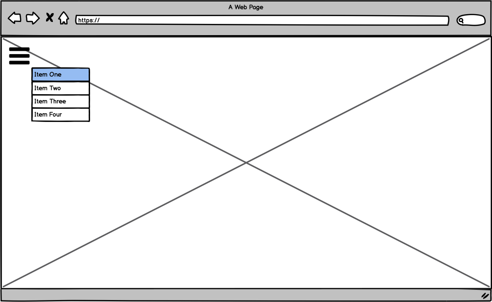

# constellations
## Live Link
http://tongsalex.com/constellations

## Space in the browser.
I wanted to build a 3D model of space for this project while exploring and utilizing the capabiltiies of Three.js to help me understand 3D renderings better so that I may utilize these technologies in the future on other projects.

	

## Features
- Users can look around 360 degrees by dragging the center of the screen in the direction they wish to view.

	

- Users can change the position of the camera using the arrow keys on their keyboard.

	

## Functionality and MVPs
- Showcase 3D rendering of space
  - 3D animations
  - User can interact with animations

## Wireframes

## Featured Technologies
- Three.js
  - In order to create the 3D canvas of space, stars and planets, I needed to learn Three.js, the 3D JavaScript library which allowed me to create a virtual rendering. All of the objects and space itself in the visualization were created using Three.js.

## Major Technologies Used
* HTML
* CSS
* Javascript
* Webpack

## Implementation Timeline (3 Days)
* Day 1
  * Get a basic Three.js canvas up
* Day 2
  * Create planets and stars
  * Implement movement of planets/stars and twinkling effects on stars
* Day 3
  * Check for bugs
  * Implement user interactivity to move around in space

## Instructions
1. Run "npm install"
2. Run "npm start" to see in local browser

Other notes
(To update github live link)
1. run "npm run webpack:build"
2. git add, commit & push to github
