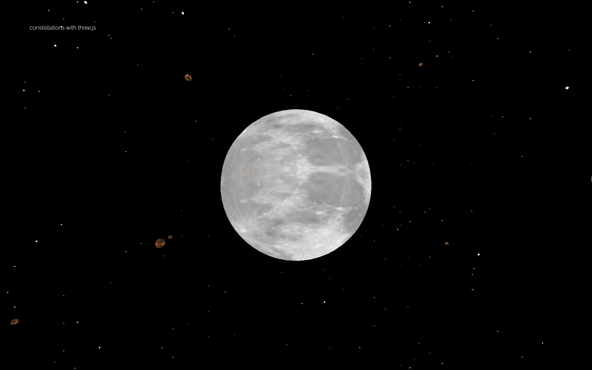

# constellations

An interactive 3D space visualization built with Three.js. Explore stars, planets, and asteroids in your browser.

**[Live Demo](https://alextongme.github.io/constellations/)**



## Features

- Full-viewport 3D scene with 1000+ stars, textured planets, and drifting asteroids
- Orbit controls — drag to rotate, scroll to zoom
- Observatory-style HUD overlay with live camera coordinates
- Auto-deploys via GitHub Actions

## Tech Stack

- **Three.js** — 3D rendering, orbit controls, texture mapping
- **Vite** — build tooling, dev server, asset pipeline
- **GitHub Pages** — hosting via Actions CI/CD
- Vanilla JS, CSS custom properties, no framework

## Development

```bash
npm install
npm run dev
```

## Build

```bash
npm run build
npm run preview
```

## Architecture

See [REVAMP.md](./REVAMP.md) for detailed architecture decisions and technical tradeoffs from the project revamp.
